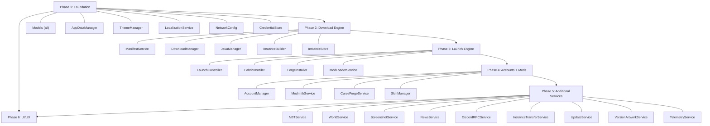

# Onyx Launcher: macOS → Windows Migration Plan

> **Source**: `onyx-macos/` (Swift 5.10 + SwiftUI, macOS 14+)
> **Target**: `OnyxWindows/` (C# 12 + WPF, .NET 8, Windows 10/11)
> **Scope**: 62 Swift files → ~85 C# files | ~19,000 LOC Swift → ~22,000 LOC C#

---

## User Review Required

> [!IMPORTANT]
> **UI Framework Choice**: This plan uses **WPF** (Windows Presentation Foundation) for maximum UI customization and visual parity with the SwiftUI macOS version. WPF supports custom window chrome, acrylic/mica effects, gradient backgrounds, animations, and full theming — all required by the original design. Alternative: WinUI 3 (more modern but less mature for custom chrome). **Please confirm WPF is acceptable.**

> [!IMPORTANT]
> **Sparkle → Squirrel/AutoUpdater**: The macOS version uses Sparkle for auto-updates. On Windows, we'll use **Velopack** (modern .NET auto-updater, successor to Squirrel). Please confirm, or specify an alternative (e.g., manual GitHub Releases check).

> [!WARNING]
> **CurseForge API Key**: The macOS source contains a hardcoded CurseForge API key (`$2a$10$Gqko...`). This key should be moved to a configuration file or environment variable for the Windows build. We will keep the same key but load it from `appsettings.json`.

> [!IMPORTANT]
> **Discord RPC**: The macOS version uses raw Unix domain sockets for Discord IPC. On Windows, Discord uses **Named Pipes** (`\\.\pipe\discord-ipc-{0-9}`). The protocol is identical (JSON + binary header), only the transport layer changes.

## Open Questions

> [!IMPORTANT]
> 1. **Code Signing**: Do you want MSIX packaging with code signing, or a portable `.exe` + auto-updater?
> 2. **Installer**: Should we create an installer (e.g., Inno Setup, MSIX) or distribute as a portable app?
> 3. **Minimum Windows version**: Windows 10 1809+ or Windows 11 only?
> 4. **Single-instance**: Should only one copy of the launcher run at a time? (macOS version doesn't enforce this)

---

## Architecture Overview

### Swift → C# Technology Mapping

| Swift/macOS Concept | C#/Windows Equivalent |
|---|---|
| `@Observable` / `@State` | `ObservableObject` (CommunityToolkit.Mvvm `[ObservableProperty]`) |
| `@Environment` (DI) | `Microsoft.Extensions.DependencyInjection` |
| SwiftUI `View` | WPF `UserControl` + XAML |
| `NavigationStack` / `sheet` | WPF `ContentControl` binding + modal `Window` |
| `URLSession` | `HttpClient` (singleton via `IHttpClientFactory`) |
| `Process` (Foundation) | `System.Diagnostics.Process` |
| `FileManager` | `System.IO.File` / `Directory` |
| Keychain (Security.framework) | `System.Security.Cryptography.ProtectedData` (DPAPI) |
| `CryptoKit` (SHA1, MD5) | `System.Security.Cryptography` |
| `Codable` (JSON) | `System.Text.Json` with source generators |
| `async/await` (Swift) | `async/await` (C# — identical pattern) |
| `Task {}` (Swift) | `Task.Run()` / `await` |
| `@MainActor` | `Dispatcher.Invoke` / `DispatcherTimer` |
| `NSImage` | `System.Windows.Media.Imaging.BitmapImage` |
| `NSSavePanel` / `NSOpenPanel` | `Microsoft.Win32.SaveFileDialog` / `OpenFileDialog` |
| `Bundle.main` | `Assembly.GetExecutingAssembly()` |
| macOS `zip`/`unzip` CLI | `System.IO.Compression.ZipFile` |
| macOS `tar` CLI | `SharpCompress` NuGet or `System.Formats.Tar` |
| macOS `xattr`/`codesign` | Not needed on Windows |
| `VisualEffectBackground` (NSVisualEffectView) | WPF Mica/Acrylic via `WindowChrome` + `SetWindowCompositionAttribute` |
| Sparkle (SPUUpdater) | Velopack or manual GitHub Releases check |
| Unix Domain Sockets (Discord) | Named Pipes (`System.IO.Pipes.NamedPipeClientStream`) |

### Project Structure

```
OnyxWindows/
├── OnyxWindows.sln
├── src/
│   ├── OnyxWindows/                    # Main WPF Application
│   │   ├── App.xaml / App.xaml.cs      # Entry point, DI container
│   │   ├── MainWindow.xaml/.cs         # Shell window (custom chrome)
│   │   ├── Models/
│   │   │   ├── GlobalConfig.cs
│   │   │   ├── Instance.cs
│   │   │   ├── Account.cs
│   │   │   ├── VersionManifest.cs
│   │   │   ├── WorldSettings.cs
│   │   │   ├── VersionFilter.cs
│   │   │   ├── ModLoaderType.cs
│   │   │   ├── InstanceStatus.cs
│   │   │   └── ThemeType.cs
│   │   ├── ViewModels/
│   │   │   ├── MainViewModel.cs
│   │   │   ├── InstanceGridViewModel.cs
│   │   │   ├── CreateInstanceViewModel.cs
│   │   │   ├── InstanceSettingsViewModel.cs
│   │   │   ├── ModBrowserViewModel.cs
│   │   │   ├── SkinBrowserViewModel.cs
│   │   │   ├── ScreenshotsViewModel.cs
│   │   │   ├── WorldsViewModel.cs
│   │   │   ├── NewsViewModel.cs
│   │   │   ├── SettingsViewModel.cs
│   │   │   ├── OnboardingViewModel.cs
│   │   │   ├── AccountSwitcherViewModel.cs
│   │   │   ├── ConsoleViewModel.cs
│   │   │   └── WorldSettingsViewModel.cs
│   │   ├── Services/
│   │   │   ├── AppDataManager.cs
│   │   │   ├── ThemeManager.cs
│   │   │   ├── InstanceStore.cs
│   │   │   ├── InstanceBuilder.cs
│   │   │   ├── LaunchController.cs
│   │   │   ├── AccountManager.cs
│   │   │   ├── ManifestService.cs
│   │   │   ├── DownloadManager.cs
│   │   │   ├── JavaManager.cs
│   │   │   ├── FabricInstaller.cs
│   │   │   ├── ForgeInstaller.cs
│   │   │   ├── ModLoaderService.cs
│   │   │   ├── ModrinthService.cs
│   │   │   ├── CurseForgeService.cs
│   │   │   ├── SkinManager.cs
│   │   │   ├── ScreenshotService.cs
│   │   │   ├── WorldService.cs
│   │   │   ├── NBTService.cs
│   │   │   ├── NewsService.cs
│   │   │   ├── DiscordRPCService.cs
│   │   │   ├── InstanceTransferService.cs
│   │   │   ├── UpdateService.cs
│   │   │   ├── TelemetryService.cs
│   │   │   ├── VersionArtworkService.cs
│   │   │   ├── LocalizationService.cs
│   │   │   ├── NetworkConfig.cs
│   │   │   └── CredentialStore.cs       # DPAPI replacement for Keychain
│   │   ├── Views/
│   │   │   ├── Sidebar/
│   │   │   │   └── SidebarView.xaml/.cs
│   │   │   ├── Instances/
│   │   │   │   ├── InstanceGridView.xaml/.cs
│   │   │   │   ├── InstanceCardView.xaml/.cs
│   │   │   │   ├── CreateInstanceView.xaml/.cs
│   │   │   │   ├── InstanceSettingsView.xaml/.cs
│   │   │   │   ├── ExportInstanceView.xaml/.cs
│   │   │   │   └── EmptyStateView.xaml/.cs
│   │   │   ├── Mods/
│   │   │   │   ├── ModBrowserView.xaml/.cs
│   │   │   │   └── InstalledContentView.xaml/.cs
│   │   │   ├── Skins/
│   │   │   │   └── SkinBrowserPanel.xaml/.cs
│   │   │   ├── Screenshots/
│   │   │   │   └── ScreenshotsGalleryView.xaml/.cs
│   │   │   ├── Worlds/
│   │   │   │   ├── WorldsGalleryView.xaml/.cs
│   │   │   │   └── WorldSettingsView.xaml/.cs
│   │   │   ├── News/
│   │   │   │   └── NewsView.xaml/.cs
│   │   │   ├── Settings/
│   │   │   │   ├── GlobalSettingsView.xaml/.cs
│   │   │   │   └── UpdateBannerView.xaml/.cs
│   │   │   ├── Accounts/
│   │   │   │   ├── AccountSwitcherView.xaml/.cs
│   │   │   │   ├── AccountAvatarView.xaml/.cs
│   │   │   │   ├── AccountSkinPickerView.xaml/.cs
│   │   │   │   ├── AddOfflineAccountView.xaml/.cs
│   │   │   │   └── MicrosoftAuthView.xaml/.cs
│   │   │   ├── Onboarding/
│   │   │   │   └── OnboardingView.xaml/.cs
│   │   │   ├── Console/
│   │   │   │   └── ConsoleView.xaml/.cs
│   │   │   └── Components/
│   │   │       ├── DownloadProgressView.xaml/.cs
│   │   │       ├── SearchBox.xaml/.cs
│   │   │       └── TopBarView.xaml/.cs
│   │   ├── Converters/
│   │   │   ├── BoolToVisibilityConverter.cs
│   │   │   ├── HexToColorConverter.cs
│   │   │   ├── TimeSpanToStringConverter.cs
│   │   │   ├── FileSizeConverter.cs
│   │   │   └── EnumToStringConverter.cs
│   │   ├── Helpers/
│   │   │   ├── ColorHelper.cs
│   │   │   ├── WindowHelper.cs          # Acrylic/Mica, custom chrome
│   │   │   ├── RelayCommand.cs          # (or via CommunityToolkit)
│   │   │   └── AsyncRelayCommand.cs
│   │   ├── Resources/
│   │   │   ├── Themes/
│   │   │   │   ├── DarkTheme.xaml
│   │   │   │   ├── LightTheme.xaml
│   │   │   │   └── SharedStyles.xaml
│   │   │   ├── Icons/                   # SF Symbols → Segoe Fluent Icons / custom SVGs
│   │   │   ├── Fonts/
│   │   │   └── Assets/
│   │   └── OnyxWindows.csproj
│   └── OnyxWindows.Tests/              # Unit tests
│       └── OnyxWindows.Tests.csproj
└── README.md
```

---

## Proposed Changes

### Phase 1: Foundation (Project Setup + Models + Core Services)

> **Goal**: Create the .NET 8 WPF project, port all data models, and implement the core infrastructure services that everything else depends on.

---

#### [NEW] OnyxWindows.sln + OnyxWindows.csproj

- .NET 8 WPF project targeting `net8.0-windows`
- NuGet packages:
  ```xml
  <PackageReference Include="CommunityToolkit.Mvvm" Version="8.*" />
  <PackageReference Include="Microsoft.Extensions.DependencyInjection" Version="8.*" />
  <PackageReference Include="Microsoft.Extensions.Http" Version="8.*" />
  <PackageReference Include="System.Text.Json" Version="8.*" />
  <PackageReference Include="SharpCompress" Version="0.37.*" />  <!-- tar.gz extraction -->
  <PackageReference Include="Microsoft.Web.WebView2" Version="1.*" /> <!-- MS OAuth -->
  ```

---

#### Models (1:1 port from Swift structs)

##### [NEW] `Models/GlobalConfig.cs`
**Source**: [GlobalConfig.swift](file:///c:/Users/akorn/Documents/GitHub/onyx-windows/OnyxWindows/onyx-macos/Onyx/Models/GlobalConfig.swift)

```
Properties (all identical):
- Nickname (string, default "Player")
- DefaultRamMB (int, default 4096)
- Theme (ThemeType enum)
- CustomTheme (CustomThemeColors?)
- DefaultJavaPath (string?)
- Language (AppLanguage enum: en, uk, de, es, fr, pl)
- ShowConsoleOnLaunch (bool)
- CloseLauncherOnLaunch (bool)
- AccumulatedPlayTime (double)
- ActiveSkinName (string?)
- DefaultGameWidth/Height (int?)
- DefaultFullscreen (bool)
- DefaultGuiScale (int, default 0)
- HasCompletedOnboarding (bool)
- EnableDiscordRPC (bool, default true)
- EnableTelemetry (bool, default true)

Custom JSON deserialization with defaults for missing fields (same pattern as Swift).
```

##### [NEW] `Models/Instance.cs`
**Source**: [Instance.swift](file:///c:/Users/akorn/Documents/GitHub/onyx-windows/OnyxWindows/onyx-macos/Onyx/Models/Instance.swift)

```
Identical fields: Id (Guid), Name, MinecraftVersion, ModLoader?, ModLoaderVersion?,
RamMB, JavaPath?, JvmArguments (List<string>), CustomIconPath?, CreatedAt, LastPlayedAt?,
Status (enum), TotalPlayTime, LastSessionTime, InstalledModrinthFiles (Dict?),
InstalledCFMeta (Dict?), GameWidth?, GameHeight?, Fullscreen, AutoJoinServer?, AutoJoinPort?

DirectoryName property: sanitize invalid path chars (same logic, using Path.GetInvalidFileNameChars())
```

##### [NEW] `Models/Account.cs`
**Source**: [Account.swift](file:///c:/Users/akorn/Documents/GitHub/onyx-windows/OnyxWindows/onyx-macos/Onyx/Models/Account.swift)

```
Same fields. Tokens excluded from JSON serialization via [JsonIgnore].
Tokens stored in DPAPI-encrypted file instead of Keychain.
```

##### [NEW] `Models/VersionManifest.cs`
**Source**: [VersionManifest.swift](file:///c:/Users/akorn/Documents/GitHub/onyx-windows/OnyxWindows/onyx-macos/Onyx/Models/VersionManifest.swift)

```
All 18 model structs ported as C# records/classes:
VersionManifest, LatestVersions, VersionEntry, VersionType (enum),
VersionDetail, GameArguments, ArgumentValue (union → JsonConverter),
ConditionalArgument, Library, LibraryDownloads, LibraryArtifact,
Rule, OSRule, VersionDownloads, DownloadInfo, AssetIndexInfo,
AssetIndex, AssetObject, JavaVersionInfo, LoggingConfig, etc.

Key change: ArgumentValue union type → custom JsonConverter<ArgumentValue>
(Swift enum with associated values → C# abstract base + derived classes + custom converter)
```

##### [NEW] `Models/WorldSettings.cs`
**Source**: [WorldSettings.swift](file:///c:/Users/akorn/Documents/GitHub/onyx-windows/OnyxWindows/onyx-macos/Onyx/Models/WorldSettings.swift)

```
Port as ObservableObject with all fields.
MinecraftGameMode, MinecraftDifficulty enums with display names (EN + UK).
NBT ↔ settings bidirectional mapping (init from NBT, applyToNBT).
```

##### [NEW] `Models/VersionFilter.cs`, `Models/ModLoaderType.cs`, `Models/InstanceStatus.cs`, `Models/ThemeType.cs`

Simple enums, direct 1:1 port.

---

#### Core Services

##### [NEW] `Services/AppDataManager.cs`
**Source**: [AppDataManager.swift](file:///c:/Users/akorn/Documents/GitHub/onyx-windows/OnyxWindows/onyx-macos/Onyx/Services/AppDataManager.swift)

```
Key changes:
- Base directory: Environment.GetFolderPath(SpecialFolder.ApplicationData) + "OnyxLauncher"
  (macOS uses ~/Library/Application Support/com.onyx.launcher)
- All subdirectories identical: java/, cache/, instances/, meta/, icons/, skins/,
  cache/assets/, cache/assets/indexes/, cache/assets/objects/, cache/libraries/, cache/versions/
- Config file: config.json (same format)
- Accounts file: accounts.json (same format)
- LibraryPath(): Maven layout — identical logic
```

##### [NEW] `Services/NetworkConfig.cs`
**Source**: [NetworkConfig.swift](file:///c:/Users/akorn/Documents/GitHub/onyx-windows/OnyxWindows/onyx-macos/Onyx/Services/NetworkConfig.swift)

```
Register a named HttpClient "OnyxClient" via IHttpClientFactory with:
- Timeout: 30s request, 120s resource
- User-Agent: "OnyxLauncher/1.0"
```

##### [NEW] `Services/CredentialStore.cs` (NEW — replaces macOS Keychain)

```
Windows DPAPI implementation:
- SaveTokens(Guid accountId, string accessToken, string? refreshToken)
- LoadTokens(Guid accountId) → (string accessToken, string? refreshToken)?
- DeleteTokens(Guid accountId)

Uses ProtectedData.Protect/Unprotect with DataProtectionScope.CurrentUser.
Tokens stored as encrypted JSON files in AppData/OnyxLauncher/credentials/{accountId}.dat
```

##### [NEW] `Services/ThemeManager.cs`
**Source**: [ThemeManager.swift](file:///c:/Users/akorn/Documents/GitHub/onyx-windows/OnyxWindows/onyx-macos/Onyx/Services/ThemeManager.swift)

```
Exact color values preserved:
- Dark: Background=#0F1721, Surface=#1A2636, Accent=#4D8AEB, Text=White
- Light: Background=#F5F7FA, Surface=White, Accent=#3878D9, Text=#1A1A1F
- Custom: user-defined hex colors with gradient support

WPF implementation:
- ResourceDictionary swapping for theme changes
- System theme detection via SystemParameters.HighContrast + Registry watch
- CustomThemeColors with gradient angle → LinearGradientBrush
- Color.FromHex() extension method (same parsing logic)
```

##### [NEW] `Services/LocalizationService.cs`
**Source**: [Localization.swift](file:///c:/Users/akorn/Documents/GitHub/onyx-windows/OnyxWindows/onyx-macos/Onyx/Services/Localization.swift) (2680 lines!)

```
Port the entire key→value dictionary for EN + UK + DE + ES + FR + PL.
Same t("key") method pattern.
Implementation: Dictionary<string, Dictionary<AppLanguage, string>>
All 2680 lines of translations must be preserved identically.
```

---

### Phase 2: Download Engine + Minecraft Core

> **Goal**: Port the Minecraft version manifest, download manager, Java manager, and instance builder — the core engine that downloads and prepares Minecraft for launch.

---

##### [NEW] `Services/ManifestService.cs`
**Source**: [ManifestService.swift](file:///c:/Users/akorn/Documents/GitHub/onyx-windows/OnyxWindows/onyx-macos/Onyx/Services/ManifestService.swift)

```
Identical logic:
- Fetch https://launchermeta.mojang.com/mc/game/version_manifest_v2.json
- Cache in meta/mojang_manifest.json, refresh if >24h old
- FetchVersionDetail(): download per-version JSON, cache in cache/versions/{id}/{id}.json
- Filter methods: versions by type (release/snapshot/oldBeta/oldAlpha)
```

##### [NEW] `Services/DownloadManager.cs`
**Source**: [DownloadManager.swift](file:///c:/Users/akorn/Documents/GitHub/onyx-windows/OnyxWindows/onyx-macos/Onyx/Services/DownloadManager.swift)

```
Parallel downloader with SHA1 verification.
Key changes:
- maxConcurrent = 32 (same)
- SHA1 verification: CryptoKit → System.Security.Cryptography.SHA1
- Streaming SHA1 for existing files: identical InputStream → FileStream
- SemaphoreSlim for throttling instead of TaskGroup manual throttle
- IProgress<DownloadProgress> for UI updates
```

##### [NEW] `Services/JavaManager.cs`
**Source**: [JavaManager.swift](file:///c:/Users/akorn/Documents/GitHub/onyx-windows/OnyxWindows/onyx-macos/Onyx/Services/JavaManager.swift)

```
Critical platform changes:
- Architecture detection: RuntimeInformation.OSArchitecture (x64/Arm64)
- Adoptium API: OS=windows (was mac), arch=x64 or aarch64
  URL: https://api.adoptium.net/v3/binary/latest/{version}/ga/windows/{arch}/jdk/hotspot/normal/eclipse
- Archive format: .zip (not .tar.gz on Windows)
  Extract via ZipFile.ExtractToDirectory()
- Java executable path: {dir}/bin/java.exe (not Contents/Home/bin/java)
- No need for chmod, xattr, or codesign
- Directories: temurin-{version}-{arch}/ (same pattern)
```

##### [NEW] `Services/InstanceBuilder.cs`
**Source**: [InstanceBuilder.swift](file:///c:/Users/akorn/Documents/GitHub/onyx-windows/OnyxWindows/onyx-macos/Onyx/Services/InstanceBuilder.swift)

```
Critical platform changes:
- Library rules: filter os.name == "windows" (was "osx"/"macos")
- Architecture: filter for "x64" or "x86" (was "aarch64"/"arm64")
- Natives: look for "natives-windows" classifier (was "natives-macos"/"natives-osx")
- Classpath separator: ';' (was ':')
- Native extraction: .dll files from JAR (was .dylib/.jnilib)
  Extract via ZipFile (was /usr/bin/unzip)
```

##### [NEW] `Services/InstanceStore.cs`
**Source**: [InstanceStore.swift](file:///c:/Users/akorn/Documents/GitHub/onyx-windows/OnyxWindows/onyx-macos/Onyx/Services/InstanceStore.swift)

```
Identical logic:
- Load instances from instances/{name}/instance.json
- CRUD: create, save, delete, duplicate, rename
- Instance directory structure: {name}/.minecraft/mods|resourcepacks|shaderpacks|saves
- Auto-install CustomSkinLoader on instance creation (same Modrinth API call)
- Reset stale statuses on load (running/preparing → ready)
```

---

### Phase 3: Launch Engine + Mod Loaders

> **Goal**: Port the most complex service — LaunchController (1023 lines) — plus Fabric and Forge installers.

---

##### [NEW] `Services/LaunchController.cs`
**Source**: [LaunchController.swift](file:///c:/Users/akorn/Documents/GitHub/onyx-windows/OnyxWindows/onyx-macos/Onyx/Services/LaunchController.swift) (1023 lines)

```
Critical platform changes:

1. JVM Arguments:
   - REMOVE: -XstartOnFirstThread (macOS-only, MUST NOT be on Windows!)
   - Classpath separator: ';' (was ':')
   - java.library.path uses Windows paths

2. Native extraction:
   - Extract .dll files (not .dylib/.jnilib)
   - Use ZipFile (not /usr/bin/unzip)
   - No xattr or codesign needed

3. Process management:
   - Process class: System.Diagnostics.Process
   - process.StartInfo.FileName = javaPath
   - process.StartInfo.Arguments = string.Join(" ", args)
   - process.StartInfo.WorkingDirectory = gameDir
   - process.StartInfo.RedirectStandardOutput/Error = true
   - process.StartInfo.UseShellExecute = false
   - process.OutputDataReceived += handler
   - process.ErrorDataReceived += handler
   - process.Exited += handler

4. Template substitution:
   - ${classpath_separator} → ";" (was ":")
   - ${library_directory} → Windows paths

5. Window resolution:
   - Fullscreen via options.txt (same)
   - --width/--height for windowed mode (same)

6. Auto-join server logic: identical

7. UUID generation (offline):
   - MD5 hash identical algorithm, use System.Security.Cryptography.MD5

8. options.txt patching:
   - Language mapping identical (uk_ua, de_de, etc.)
   - Fullscreen, guiScale, overrideWidth/Height: same logic

9. Classpath deduplication:
   - Identical algorithm, change path separator to '\' and classpath separator to ';'

10. Close launcher on launch:
    - Application.Current.Shutdown() (was NSApplication.shared.terminate)
```

##### [NEW] `Services/FabricInstaller.cs`
**Source**: [FabricInstaller.swift](file:///c:/Users/akorn/Documents/GitHub/onyx-windows/OnyxWindows/onyx-macos/Onyx/Services/FabricInstaller.swift)

```
Identical logic — API calls to meta.fabricmc.net / meta.quiltmc.org.
Only change: classpath paths use Windows separators.
```

##### [NEW] `Services/ForgeInstaller.cs`
**Source**: [ForgeInstaller.swift](file:///c:/Users/akorn/Documents/GitHub/onyx-windows/OnyxWindows/onyx-macos/Onyx/Services/ForgeInstaller.swift)

```
Changes:
- Download URLs: identical (maven.minecraftforge.net, maven.neoforged.net)
- Run installer: Process.Start("java.exe", "-jar installer.jar --installClient ...")
- Legacy Forge extraction: ZipFile instead of /usr/bin/unzip
- isValidJarFile: same ZIP magic bytes check
- launcher_profiles.json mock: identical
```

##### [NEW] `Services/ModLoaderService.cs`
**Source**: [ModLoaderService.swift](file:///c:/Users/akorn/Documents/GitHub/onyx-windows/OnyxWindows/onyx-macos/Onyx/Services/ModLoaderService.swift)

```
Fetches available mod loader versions from APIs:
- Fabric: https://meta.fabricmc.net/v2/versions/loader/{mcVersion}
- Quilt: https://meta.quiltmc.org/v3/versions/loader/{mcVersion}
- Forge: https://maven.minecraftforge.net/net/minecraftforge/forge/maven-metadata.xml
- NeoForge: https://maven.neoforged.net/api/maven/versions/releases/net/neoforged/neoforge
All API calls are platform-independent. Direct 1:1 port.
```

---

### Phase 4: Account System + Mod Browsing

> **Goal**: Port the Microsoft OAuth flow, account management, and mod browsing (Modrinth + CurseForge).

---

##### [NEW] `Services/AccountManager.cs`
**Source**: [AccountManager.swift](file:///c:/Users/akorn/Documents/GitHub/onyx-windows/OnyxWindows/onyx-macos/Onyx/Services/AccountManager.swift) (661 lines)

```
Changes:
1. Keychain → CredentialStore (DPAPI) for token storage
2. Microsoft OAuth:
   - Same flow: MS OAuth → Xbox Live → XSTS → MC Login → MC Profile
   - Same client ID: 00000000402b5328
   - Same redirect URI: https://login.live.com/oauth20_desktop.srf
   - WebView: WKWebView → WebView2 (Microsoft.Web.WebView2)
3. Head image: NSImage → BitmapImage (download from mc-heads.net, same URLs)
4. Token refresh: identical flow
5. Offline UUID generation: identical MD5 algorithm
```

##### [NEW] `Services/ModrinthService.cs`
**Source**: [ModrinthService.swift](file:///c:/Users/akorn/Documents/GitHub/onyx-windows/OnyxWindows/onyx-macos/Onyx/Services/ModrinthService.swift) (559 lines)

```
Pure API service — 100% platform-independent. Direct 1:1 port.
All Modrinth API models (ModrinthProject, ModrinthVersion, ModrinthFile, etc.)
port as C# records with [JsonPropertyName] attributes.
Search, getVersions, getProjectDetail, downloadMod, fetchProjects — all identical.
```

##### [NEW] `Services/CurseForgeService.cs`
**Source**: [CurseForgeService.swift](file:///c:/Users/akorn/Documents/GitHub/onyx-windows/OnyxWindows/onyx-macos/Onyx/Services/CurseForgeService.swift) (383 lines)

```
Pure API service — 100% platform-independent. Direct 1:1 port.
API key loaded from config (same key). CDN fallback URL logic identical.
```

##### [NEW] `Services/SkinManager.cs`
**Source**: [SkinManager.swift](file:///c:/Users/akorn/Documents/GitHub/onyx-windows/OnyxWindows/onyx-macos/Onyx/Services/SkinManager.swift) (601 lines)

```
Changes:
- NSImage → BitmapImage for skin rendering
- mc-heads.net API calls: identical (platform-independent)
- Popular usernames pool: identical (95 names)
- CustomSkinLoader installation: identical (Modrinth API)
- Library persistence: library.json in skins/ directory (same)
- File operations: FileManager → File/Directory
```

---

### Phase 5: Additional Services

> **Goal**: Port remaining services — NBT, World, Screenshots, News, Discord RPC, Transfer, Updates.

---

##### [NEW] `Services/NBTService.cs`
**Source**: [NBTService.swift](file:///c:/Users/akorn/Documents/GitHub/onyx-windows/OnyxWindows/onyx-macos/Onyx/Services/NBTService.swift) (354 lines)

```
Custom NBT parser/writer. Binary format — completely platform-independent.
NBTTag enum → C# abstract class + derived types:
  NBTCompound, NBTList, NBTString, NBTInt, NBTLong, NBTByte, NBTShort,
  NBTFloat, NBTDouble, NBTByteArray, NBTIntArray, NBTLongArray

GZip decompression: DeflateStream / GZipStream (was Foundation's built-in)
BigEndian read/write: BinaryPrimitives.ReadInt32BigEndian, etc.
```

##### [NEW] `Services/WorldService.cs`
**Source**: [WorldService.swift](file:///c:/Users/akorn/Documents/GitHub/onyx-windows/OnyxWindows/onyx-macos/Onyx/Services/WorldService.swift) (433 lines)

```
Reads level.dat NBT files, generates world previews.
Platform-independent logic. Changes:
- NSImage icon generation → BitmapImage
- File paths use Path.Combine
```

##### [NEW] `Services/ScreenshotService.cs`
**Source**: [ScreenshotService.swift](file:///c:/Users/akorn/Documents/GitHub/onyx-windows/OnyxWindows/onyx-macos/Onyx/Services/ScreenshotService.swift) (150 lines)

```
Scans .minecraft/screenshots/ for PNG files. NSImage → BitmapImage.
Open in system viewer: Process.Start("explorer", path) or Process.Start(path) with UseShellExecute=true.
```

##### [NEW] `Services/NewsService.cs`
**Source**: [NewsService.swift](file:///c:/Users/akorn/Documents/GitHub/onyx-windows/OnyxWindows/onyx-macos/Onyx/Services/NewsService.swift) (62 lines)

```
Fetches news from minecraft.net RSS/JSON. Platform-independent API calls.
```

##### [NEW] `Services/DiscordRPCService.cs`
**Source**: [DiscordRPCService.swift](file:///c:/Users/akorn/Documents/GitHub/onyx-windows/OnyxWindows/onyx-macos/Onyx/Services/DiscordRPCService.swift) (203 lines)

```
Critical platform change:
- Unix domain sockets → Named Pipes
- Socket path: \\.\pipe\discord-ipc-{0-9}
- Connection: new NamedPipeClientStream(".", "discord-ipc-{i}", PipeDirection.InOut)
- Protocol: IDENTICAL (JSON + 8-byte binary header: opcode LE uint32 + length LE uint32)
- Same Discord App ID: 1506949090498318437
- Same activity payload structure
```

##### [NEW] `Services/InstanceTransferService.cs`
**Source**: [InstanceTransferService.swift](file:///c:/Users/akorn/Documents/GitHub/onyx-windows/OnyxWindows/onyx-macos/Onyx/Services/InstanceTransferService.swift) (648 lines)

```
Changes:
- ZIP creation/extraction: System.IO.Compression.ZipFile (not /usr/bin/zip + /usr/bin/unzip)
- NSSavePanel → SaveFileDialog (Microsoft.Win32)
- NSOpenPanel → OpenFileDialog (Microsoft.Win32)
- Security-scoped resource access: not needed on Windows
- OnyxProfile: identical JSON format (cross-platform compatible!)
- Folder import, ZIP import: identical logic
```

##### [NEW] `Services/UpdateService.cs`
**Source**: [UpdateService.swift](file:///c:/Users/akorn/Documents/GitHub/onyx-windows/OnyxWindows/onyx-macos/Onyx/Services/UpdateService.swift) (208 lines)

```
Complete rewrite — Sparkle → Velopack (or manual GitHub Releases API check).
States: Idle, Checking, Available, Downloading, ReadyToInstall, UpToDate, Error
Same UI states, different backend.
```

##### [NEW] `Services/VersionArtworkService.cs`
**Source**: [VersionArtworkService.swift](file:///c:/Users/akorn/Documents/GitHub/onyx-windows/OnyxWindows/onyx-macos/Onyx/Services/VersionArtworkService.swift) (237 lines)

```
Downloads MC version artwork/icons. Platform-independent API calls.
NSImage → BitmapImage for icon caching.
```

##### [NEW] `Services/TelemetryService.cs`
**Source**: [TelemetryService.swift](file:///c:/Users/akorn/Documents/GitHub/onyx-windows/OnyxWindows/onyx-macos/Onyx/Services/TelemetryService.swift) (37 lines)

```
Simple analytics signal sender. Platform-independent HTTP POST.
```

---

### Phase 6: UI/UX (WPF Views)

> **Goal**: Recreate the entire SwiftUI interface in WPF XAML with exact visual parity.

---

#### Design System (Theme Resources)

##### [NEW] `Resources/Themes/DarkTheme.xaml`
```
Exact color values from ThemeManager:
- Background: #0F1721 (rgb 0.06, 0.09, 0.13)
- Surface:    #1A2636 (rgb 0.10, 0.15, 0.21)
- Accent:     #4D8AEB (rgb 0.30, 0.54, 0.92)
- PrimaryText: #FFFFFF
- SecondaryText: #FFFFFF @ 55% opacity

Styles for: Button, TextBox, ComboBox, ScrollViewer, ListBox, Border, etc.
All with rounded corners (CornerRadius=8), smooth transitions.
```

##### [NEW] `Resources/Themes/LightTheme.xaml`
```
- Background: #F5F7FA (rgb 0.96, 0.97, 0.98)
- Surface:    #FFFFFF
- Accent:     #3878D9 (rgb 0.22, 0.47, 0.85)
- PrimaryText: #1A1A1F (rgb 0.10, 0.10, 0.12)
- SecondaryText: #666B73 (rgb 0.40, 0.42, 0.45)
```

##### [NEW] `Resources/Themes/SharedStyles.xaml`
```
Common styles shared between themes:
- Animations (FadeIn, SlideIn, ScaleUp)
- Card style (RoundedRectangle, shadow, hover effect)
- Sidebar item style (icon + text, active highlight)
- Search box style
- Progress bar style
- Tooltip style
```

---

#### Icon Mapping (SF Symbols → Segoe Fluent Icons / Custom)

| Swift SF Symbol | WPF Segoe Fluent Icon | Unicode |
|---|---|---|
| `square.grid.2x2` | Grid | `\uF0E2` |
| `person.crop.square` | Contact | `\uE77B` |
| `photo.on.rectangle.angled` | Photo | `\uEB9F` |
| `map` | Map | `\uE707` |
| `newspaper` | News | `\uE7BF` |
| `gearshape` | Settings | `\uE713` |
| `magnifyingglass` | Search | `\uE721` |
| `plus` | Add | `\uE710` |
| `xmark.circle.fill` | Cancel | `\uE711` |
| `play.fill` | Play | `\uE768` |
| `stop.fill` | Stop | `\uE71A` |
| `folder` | Folder | `\uE8B7` |
| `trash` | Delete | `\uE74D` |
| `doc.on.doc` | Copy | `\uE8C8` |
| `pencil` | Edit | `\uE70F` |
| `arrow.down.circle` | Download | `\uE896` |
| `checkmark.circle.fill` | CheckMark | `\uE73E` |
| `exclamationmark.triangle` | Warning | `\uE7BA` |
| `heart.fill` | Heart | `\uEB52` |
| `star.fill` | FavoriteStar | `\uE734` |
| `eye.fill` | View | `\uE7B3` |

---

#### Main Window

##### [NEW] `MainWindow.xaml / MainWindow.xaml.cs`

```
Custom chrome window (hidden title bar, like macOS .windowStyle(.hiddenTitleBar)):
- WindowChrome with CaptionHeight=0, ResizeBorderThickness=4
- Custom title bar with drag area, minimize/maximize/close buttons
- Min size: 900×600 (same as macOS), Default: 1100×720
- Acrylic/Mica background effect via WindowHelper

Layout:
┌─────────┬──────────────────────────────────┐
│         │  TopBarView (search + account +   │
│ Sidebar │  add instance button)             │
│  200px  │──────────────────────────────────│
│         │  Content Area                     │
│         │  (switches by SidebarSection)     │
└─────────┴──────────────────────────────────┘

Sidebar: SidebarView (200px width, semi-transparent background)
- Shadow: 8px radius, black 25% opacity, x-offset=2

Content: ContentPresenter bound to SelectedSection
Download overlay: semi-transparent black (0.4 opacity) + centered panel
Import overlay: same pattern with progress/checkmark/error icon
```

##### [NEW] `Views/Sidebar/SidebarView.xaml`
**Source**: [SidebarView.swift](file:///c:/Users/akorn/Documents/GitHub/onyx-windows/OnyxWindows/onyx-macos/Onyx/Views/Sidebar/SidebarView.swift) (66 lines)

```
Sections: Instances, Skins, Screenshots, Worlds, News, Settings
Each item: Icon + localized text, active state highlight with accent color
Vertical ListBox with custom ItemTemplate, no borders, transparent background
```

##### [NEW] `Views/Components/TopBarView.xaml`
**Source**: [ContentView.swift](file:///c:/Users/akorn/Documents/GitHub/onyx-windows/OnyxWindows/onyx-macos/Onyx/App/ContentView.swift#L168-L286) (TopBarView struct)

```
HStack layout:
- SearchBox (max width 320px, rounded rect background)
- Spacer
- Account switcher button (avatar + name, popup on click)
- "Create Instance" button (accent color, plus icon)
Divider line at bottom
```

---

#### Instance Views

##### [NEW] `Views/Instances/InstanceGridView.xaml`
**Source**: [InstanceGridView.swift](file:///c:/Users/akorn/Documents/GitHub/onyx-windows/OnyxWindows/onyx-macos/Onyx/Views/Instances/InstanceGridView.swift) (385 lines)

```
WrapPanel of InstanceCards, filtered by searchText.
Context menu per card: Play, Settings, Open Folder, Duplicate, Export, Delete.
Drag-and-drop import (ZIP files or folders).
Empty state view when no instances.
```

##### [NEW] `Views/Instances/InstanceCardView.xaml`
**Source**: [InstanceCardView.swift](file:///c:/Users/akorn/Documents/GitHub/onyx-windows/OnyxWindows/onyx-macos/Onyx/Views/Instances/InstanceCardView.swift) (290 lines)

```
Card design:
- 180×240px approximately
- Rounded corners (12px)
- Surface background color
- Version artwork as card header image
- Instance name (bold, 14px)
- MC version + mod loader badge
- Status indicator (colored dot)
- Play time display
- Hover effect: slight scale + shadow increase
- Double-click: launch or open settings
- Right-click: context menu
```

##### [NEW] `Views/Instances/CreateInstanceView.xaml`
**Source**: [CreateInstanceView.swift](file:///c:/Users/akorn/Documents/GitHub/onyx-windows/OnyxWindows/onyx-macos/Onyx/Views/Instances/CreateInstanceView.swift) (313 lines)

```
Modal dialog:
- Instance name text field
- MC version picker (ComboBox with filter tabs: Release/Snapshot/Beta/Alpha)
- Mod loader picker (None/Fabric/Quilt/Forge/NeoForge)
- Mod loader version picker (auto-populated)
- RAM slider (512MB → system max)
- Create button (accent color)
```

##### [NEW] `Views/Instances/InstanceSettingsView.xaml`
**Source**: [InstanceSettingsView.swift](file:///c:/Users/akorn/Documents/GitHub/onyx-windows/OnyxWindows/onyx-macos/Onyx/Views/Instances/InstanceSettingsView.swift) (619 lines)

```
Tabs: General, Java, Mods, Resource Packs, Shaders, Worlds
General: name, version, mod loader, RAM, JVM args, resolution, auto-join server
Java: custom java path, JVM arguments
Mods/RP/Shaders/Worlds: file browser + install from Modrinth/CurseForge
```

##### [NEW] `Views/Instances/ExportInstanceView.xaml`
**Source**: [ExportInstanceView.swift](file:///c:/Users/akorn/Documents/GitHub/onyx-windows/OnyxWindows/onyx-macos/Onyx/Views/Instances/ExportInstanceView.swift) (319 lines)

```
Modal with checkboxes: Include Mods, Config, Resource Packs, Shaders, Saves, Options
Export button → SaveFileDialog → ZIP creation
```

---

#### Mod Browser

##### [NEW] `Views/Mods/ModBrowserView.xaml`
**Source**: [ModBrowserView.swift](file:///c:/Users/akorn/Documents/GitHub/onyx-windows/OnyxWindows/onyx-macos/Onyx/Views/Mods/ModBrowserView.swift) (2049 lines — largest view!)

```
Complex tabbed browser:
- Source toggle: Modrinth / CurseForge
- Category tabs: Mods, Modpacks, Resource Packs, Shaders, Data Packs
- Search bar + sort dropdown + loader filter
- Results grid with icon, name, author, downloads count, description
- Click → detail panel with versions, install button, gallery
- Infinite scroll (load more on scroll end)
- Install button per version → downloads to instance mods/resourcepacks/shaderpacks dir
```

##### [NEW] `Views/Mods/InstalledContentView.xaml`
**Source**: [InstalledContentView.swift](file:///c:/Users/akorn/Documents/GitHub/onyx-windows/OnyxWindows/onyx-macos/Onyx/Views/Mods/InstalledContentView.swift) (310 lines)

```
List of installed mods/resourcepacks/shaders for an instance.
Shows file name, size, source (Modrinth/CurseForge/manual).
Delete button per item. Open folder button.
```

---

#### Remaining Views (identical layout patterns)

##### [NEW] `Views/Skins/SkinBrowserPanel.xaml` (584 lines equivalent)
Browse popular skins (mc-heads.net), search by username/UUID, download to library,
assign to account. Body render preview, head avatar, skin grid.

##### [NEW] `Views/Screenshots/ScreenshotsGalleryView.xaml` (813 lines equivalent)
Gallery grid of screenshots from all instances. Click to view fullscreen overlay.
Search, sort by date, open in system viewer, delete.

##### [NEW] `Views/Worlds/WorldsGalleryView.xaml` (561 lines equivalent)
World cards with level name, game mode, difficulty, seed, last played.
Click → WorldSettingsView for editing.

##### [NEW] `Views/Worlds/WorldSettingsView.xaml` (875 lines equivalent)
Edit world: game mode, difficulty, spawn point, time/weather, world border, game rules.
All via NBT parsing/writing.

##### [NEW] `Views/News/NewsView.xaml` (303 lines equivalent)
News feed from minecraft.net. Cards with image, title, date, category.
Click → open in default browser.

##### [NEW] `Views/Settings/GlobalSettingsView.xaml` (1234 lines equivalent)
Sections: General, Theme, Java, About
General: language, nickname, default RAM, console on launch, close on launch, Discord RPC, telemetry
Theme: system/dark/light/custom, color pickers, gradient toggle, angle selector
Java: installed Java versions, custom path, manage installations
About: version, play time, reset, clear cache

##### [NEW] `Views/Settings/UpdateBannerView.xaml` (135 lines equivalent)
Top banner: "Update available v{x.y.z}" → Download → Installing → Restart

##### [NEW] `Views/Accounts/MicrosoftAuthView.xaml`
WebView2 control loading Microsoft OAuth URL. Intercepts redirect with auth code.

##### [NEW] `Views/Accounts/AccountSwitcherView.xaml`
Popup/flyout with account list, active indicator, add Microsoft/offline buttons.

##### [NEW] `Views/Accounts/AddOfflineAccountView.xaml`
Simple dialog: username input (3-16 chars validation), add button.

##### [NEW] `Views/Onboarding/OnboardingView.xaml` (588 lines equivalent)
First-run wizard: Welcome → Language → Nickname → Theme → Java download → Done
Animated transitions between steps.

##### [NEW] `Views/Console/ConsoleView.xaml` (98 lines equivalent)
Separate window: scrollable log with colored lines (info=white, warning=yellow, error=red, game=gray).
Auto-scroll to bottom. Clear button.

---

## Verification Plan

### Automated Tests

```bash
# Build the solution
dotnet build OnyxWindows.sln

# Run unit tests
dotnet test OnyxWindows.Tests

# Test categories:
# 1. Model serialization/deserialization (GlobalConfig, Instance, Account, VersionManifest)
# 2. UUID generation (offline mode) — verify output matches Swift version
# 3. Maven path calculation (libraryPath)
# 4. Library rules evaluation (shouldIncludeLibrary with os=windows)
# 5. Classpath building with deduplication
# 6. NBT parser (round-trip: parse → modify → write → parse)
# 7. SHA1 hash computation
# 8. Credential store (DPAPI encrypt/decrypt round-trip)
# 9. Template substitution in launch arguments
# 10. Version comparison for classpath deduplication
```

### Manual Verification

1. **First Launch**: Onboarding wizard completes, directories created, config.json saved
2. **Create Instance**: Vanilla 1.21.4 downloads and launches successfully
3. **Fabric Instance**: Fabric mod loader installs, game launches with Fabric
4. **Forge Instance**: Forge installer runs, game launches with Forge
5. **Offline Account**: Create offline account, launch game, verify UUID
6. **Microsoft Account**: OAuth flow completes, token stored, game launches with licensed account
7. **Mod Browser**: Search Modrinth + CurseForge, install mod, verify in mods folder
8. **Skin Browser**: Browse skins, download, assign to account, verify in game
9. **Screenshots Gallery**: View screenshots from instances
10. **Worlds Editor**: Edit world settings (game mode, difficulty), verify changes saved
11. **Export/Import**: Export instance as ZIP, import on clean install
12. **Theme Switching**: Dark → Light → Custom with gradient, verify all colors
13. **Discord RPC**: Verify "Playing via Onyx Launcher" shows in Discord
14. **Auto-Update**: (After setting up update server)
15. **Console**: View game logs in console window during gameplay
16. **Localization**: Switch to Ukrainian, verify all strings

### Cross-Verification with macOS

For critical logic, compare outputs between macOS and Windows builds:
- Offline UUID for "TestPlayer" → must produce identical UUID on both platforms
- Classpath for vanilla 1.21.4 → must contain same libraries (different paths, same JARs)
- Launch arguments → must be structurally identical (minus platform-specific flags)
- config.json format → must be interchangeable between platforms

---

## Implementation Order (Dependency Graph)



---

## Summary of Platform-Critical Changes

| Area | macOS (Swift) | Windows (C#) |
|---|---|---|
| Base directory | `~/Library/Application Support/com.onyx.launcher` | `%APPDATA%\OnyxLauncher` |
| JVM flag | `-XstartOnFirstThread` | **REMOVE** (crash on Windows) |
| Classpath separator | `:` | `;` |
| Native libraries | `.dylib`, `.jnilib` | `.dll` |
| Native extraction | `/usr/bin/unzip` | `ZipFile.ExtractToDirectory` |
| OS rule filter | `osx` / `macos` | `windows` |
| Arch rule filter | `aarch64` / `arm64` | `x64` / `x86` |
| Java path | `Contents/Home/bin/java` | `bin\java.exe` |
| Java archive | `.tar.gz` | `.zip` |
| Adoptium OS param | `mac` | `windows` |
| Token storage | macOS Keychain | DPAPI encrypted file |
| ZIP operations | `/usr/bin/zip` + `/usr/bin/unzip` | `System.IO.Compression.ZipFile` |
| Quarantine removal | `xattr -cr` | Not needed |
| Code signing | `codesign -f -s -` | Not needed |
| Chmod | `/bin/chmod +x` | Not needed |
| Discord IPC | Unix domain socket `$TMPDIR/discord-ipc-{i}` | Named pipe `\\.\pipe\discord-ipc-{i}` |
| System theme detect | `AppleInterfaceStyle` UserDefaults | Registry `HKCU\...\Themes\Personalize\AppsUseLightTheme` |
| Auto-update | Sparkle (SPUUpdater) | Velopack |
| OAuth WebView | WKWebView | WebView2 |
| File dialogs | NSSavePanel / NSOpenPanel | SaveFileDialog / OpenFileDialog |
| App termination | `NSApplication.shared.terminate` | `Application.Current.Shutdown()` |
| Window vibrancy | `NSVisualEffectView` | Mica/Acrylic via `SetWindowCompositionAttribute` |
